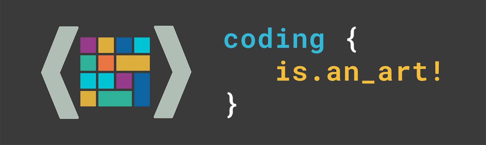

### Hi there 👋

I’m Zakariya, a full-stack software engineer, passionate programmer and a big admirer of open source who loves to contribute to any type of project. As a self-proclaimed coding-artist, I do believe that coding is a scientific discipline at a basic level, but is an art form at a more sublime level so, every programmer has his own way of writing code, and I do have my own unique touch.

## More about me ❤

- 📚 I’m currently working on ... Python & Django, OpenSource
- 🔭 I’m currently learning ... Blockchain Development
- 🙋‍♂️ I’m looking to collaborate with others on OpenSource projects
- ❔ Give it a try and ask me about anything in tech I bet I will answer 😊
- 💡 Fun fact: I love playing video games, cooking, and coding
- 🎹 Would love: To know how to play piano

<!-- Want to know more about me? [Check out my portfolio.](https://braydoncoyer.dev/) -->

## ✍ Latest Blog Posts

 

<!-- BLOG-POST-LIST:START -->
<!-- - [Tailwind Gradients - How to Make a Glowing Gradient Background](https://braydoncoyer.dev/blog/tailwind-gradients-how-to-make-a-glowing-gradient-background)
- [6 BEST Fonts for Programming in 2022](https://braydoncoyer.dev/blog/6-best-fonts-for-programming-in-2022)
- [A New Opportunity at LogicGate](https://braydoncoyer.dev/blog/a-new-opportunity-at-logicgate)
- [Create a Newsletter Subscription Form with Next.js API Routes and the Twitter Revue API](https://braydoncoyer.dev/blog/create-a-newsletter-subscription-form-with-next.js-api-routes-and-the-twitter-revue-api)
- [How to Dynamically Create Open Graph Images with Cloudinary and Next.js](https://braydoncoyer.dev/blog/how-to-dynamically-create-open-graph-images-with-cloudinary-and-next.js) -->
<!-- BLOG-POST-LIST:END -->

 

## 📌 Pinned Repositories

 

<!--   -->

<!--  -->

<!--  -->

 
 

## &#x1f4c8; GitHub Stats

 

 
 

## 💼 Skills

<!-- 

 -->

<!-- 

 -->

More Skills

 

<!--  -->

 

<!-- 

 -->

 

<!-- 

 -->

 

## 📣 How about an Office quote before you go?

> I wake up every morning in a bed that's too small, drive my daughter to a school that's too expensive, and then I go to work to a job for which I get paid too little. But on pretzel day? Well, I like pretzel day.
>
> 
- Stanley Hudson

_Quote requested from [The Office API](https://www.officeapi.dev/)_

Check back at the top of the hour for a new quote!

 

<!-- > ### Want to know how I made this README?
>
> Check out my [tutorial](https://braydoncoyer.dev/blog/creating-a-killer-github-profile-readme-part-1/)! -->

<!-- ## <h2 align="center">Other links🔗</h2>

 

<a href="https://aviyel.com/@hillarynyk" target="_blank"> 
<a href="https://anchor.fm/hillary-nyakundi" target="_blank"> 

### <h2 align="center">Support Me💰</h2>

 
 

 -->